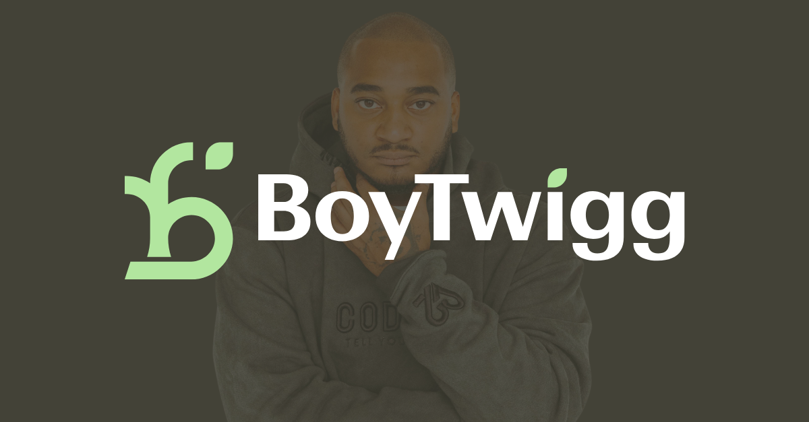

<div align="center">



**Operations Design & Automation for Small Businesses**

Systems architecture · Data migration · Workflow automation · AI agent design · Technical consulting

[me@boytwigg.com](mailto:me@boytwigg.com) · [boytwigg.com](https://boytwigg.com) · [👤 About Alex / User Manual](https://github.com/boytwigg/boytwigg)

</div>

---

## What We Do

BoyTwigg LLC helps organizations replace manual, disconnected processes with unified, automated systems, and equips individuals with AI-powered tools to multiply their output. We work across the full operations stack, from discovery and audit through implementation and delivery, and design purpose-built AI agents for venture firms, executives, and small businesses.

We also deliver workshops and keynotes at the intersection of **entrepreneurship**, **AI productivity**, and **mental wellness**, particularly for student athletes and athletic departments.

## Services

| Service | Description |
| --- | --- |
| **Operations Audit** | Map existing workflows, identify gaps, and deliver prioritized recommendations with effort estimates |
| **Systems Architecture** | Design relational databases, configure CRM platforms, and build the single source of truth your business is missing |
| **AI Agent Design** | Architect purpose-built AI agent teams to automate core business functions, from deal flow to executive communications |
| **Data Migration** | Plan and execute full platform-to-platform migrations with automated validation and zero data loss |
| **Workflow Automation** | Build end-to-end automation covering client lifecycle, internal tasks, notifications, and integrations |
| **Vendor Evaluation** | Research, compare, and recommend tools and platforms tailored to your specific needs and budget |
| **Workshops & Speaking** | Interactive workshops on AI productivity, entrepreneurship, and mental wellness for student athletes and organizations |
| **Technical Documentation** | Deliver branded client-facing reports and internal implementation guides so your team can maintain what we build |

## Tech Stack

We're platform-flexible and choose tools based on your needs, not ours.

**AI & Agent Platforms** `Tasklet` `OpenAI` `Retell AI` `Custom AI Workflows`

**Platforms & CRM** `Airtable` `Notion` `Anytype` `HubSpot`

**Automation** `Zapier` `Make (Integromat)` `Custom Webhooks` `API Integration`

**Scheduling & Payments** `Cal.com` `Calendly` `Stripe` `LawPay`

**Communication** `Dialpad` `Twilio` `Mailchimp` `Acumbamail`

**Document & E-Signature** `Proof.com` `DocuSign` `PandaDoc`

**Development & Data** `Python` `REST APIs` `JSON/CSV Transformation` `ReportLab` `Markdown`

**Research & Analysis** `Vendor evaluation frameworks` `Pricing analysis` `Compliance assessment`

## How We Work

Every engagement follows a structured methodology:

```
┌─────────────────┐     ┌─────────────────┐     ┌─────────────────┐     ┌─────────────────┐
│   Discovery &   │────▶│    Platform     │────▶│   Automation    │────▶│   Analysis &    │
│     Audit       │     │   Migration     │     │    Buildout     │     │ Recommendations │
└─────────────────┘     └─────────────────┘     └─────────────────┘     └─────────────────┘
  • Workflow mapping     • Schema design        • Discrete workflows    • Vendor evaluations
  • Gap analysis         • Data extraction       • Lifecycle coverage    • Integration scoping
  • Prioritization       • Validation pipeline   • Error handling        • Implementation specs

```

We deliver quick wins early, build toward long-term scalability, and document everything so you're never dependent on us.

---

## Portfolio

Every engagement below is described at the level of architecture and outcome. Specific client names, proprietary configurations, and sensitive business data are deliberately withheld. That restraint is the standard we hold for every client, including the ones not yet on this list.

### 🚀 Emerging Venture Firm — AI Agent Team Architecture

**Client:** An emerging venture firm · Pre-Seed/Seed · Enterprise AI focus

**Scope:** Design and deploy a team of five purpose-built AI agents to automate core firm operations across deal flow, fund operations, portfolio support, internal operations, and an education program.

**What we designed & built:**

| Functional Area | What It Does |
| --- | --- |
| **Deal Flow & Pipeline** | Automated deal intake, company enrichment, fit scoring against investment thesis, pipeline tracking, weekly deal flow summaries, stalled-deal escalation logic |
| **Fund Operations & LP Engagement** | LP relationship management and engagement cadence, capital call tracking, term sheet review against market standards, fundraise-readiness reporting |
| **Portfolio Intelligence** | Two-track portfolio support (early-stage tactical, growth-stage strategic), company monitoring, founder support routing, warm-intro facilitation |
| **Internal Operations** | Privacy-first meeting capture, intelligent email routing, calendar intelligence, separate per-partner daily briefings |
| **Education & Fellowship** | Program coordination, session content delivery, fellow progress tracking, alumni community management |

**Key outcomes:**

- Five coordinated AI agents covering the firm's entire operational surface area
- Each agent purpose-built with domain-specific knowledge and integrations
- Privacy-by-design architecture with opt-in capture and strict access boundaries
- Phased deployment sequencing that protected partner trust through rollout
- Cost-effective deployment, a full agent team at a fraction of a single hire

> **Deep dive:** The sanitized reference architecture for this engagement is published at [vc-agent-architecture](https://github.com/boytwigg/vc-agent-architecture), including the topology, the phased deployment philosophy, the privacy framework, and the coordination protocols.

---

### 🎯 Executive AI Agent Suite — Full C-Suite for One

**Client:** A high-output executive · Enterprise client roster

**Scope:** Design and deploy a four-agent AI team that functions as a personal C-suite, giving a single executive the operational capacity of an entire leadership team.

**The agent team:**

| Domain | Function |
| --- | --- |
| **Operations Command** | Owns project boards across 15+ active workstreams. Surfaces risks before they become problems. Manages delegation with context and rationale, not just task assignments. Delivers weekly production pulses and deadline intelligence. |
| **Client Intelligence** | Pre-meeting prep engine with full relationship context. Proposal drafting that matches the executive's voice. Pipeline and OKR tracking. Follow-up discipline so nothing falls through the cracks. |
| **Brand Voice** | Email drafting and triage in the executive's authentic voice. Content strategy. Portfolio and case study development. Maintains a living style guide that evolves with the brand. |
| **Life Operations** | Weekly planning rituals. Relationship maintenance prompts. Wellness and routine support. Life admin. The agent that protects the person behind the professional. |

**Key design principles:**

- Each agent has a distinct **personality and communication style**, calibrated to its domain and designed to feel human, not robotic
- Agents are **audience-aware**, adapting tone and register based on who the executive is communicating with
- Built with a **sequenced deployment strategy** (highest-burden agent first, wellness agent last, once bandwidth is freed up)
- Self-contained agents that don't depend on each other; coordination happens through shared tools and calendars

---

### 🏛️ Solo Legal Practice — Full-Stack Operations Buildout

**Client:** A solo legal practice · Multi-jurisdiction · Legacy systems

**Scope:** End-to-end systems overhaul for a solo attorney managing cases across multiple jurisdictions with no centralized CRM, no automation, and a legacy platform approaching end-of-life.

**What we delivered:**

- Migrated the full contact, matter, and billing record set from a legacy CRM with zero data loss
- Designed a **relational database** with cross-linked tables (Contacts, Cases, Tasks, Interactions, Consultations, Documents, Billing)
- Built **21 automation workflows** covering intake → consultation → onboarding → active case → closure
- Created **30 task templates** spanning all case phases and filing types
- Produced a **19-point operational audit** with branded deliverables
- Delivered comparative analyses of AI receptionist solutions, e-signature platforms, and payment processors
- Designed a **6-step automated case closing workflow** (final billing → closing letter → feedback → referral → archive)

**Portfolio samples available:**

- [Operations & Automation Case Study](portfolio/case-study.pdf) — 5-page engagement narrative
- [Workflow Review & Recommendations](portfolio/workflow-review.pdf) — 4-page operational audit
- [AI Receptionist Analysis](portfolio/ai-receptionist-analysis.pdf) — 4-page vendor comparison
- [Project Delivery Audit](portfolio/delivery-audit.pdf) — 12-page deliverable verification report

> *All portfolio documents for this engagement have been redacted to protect client confidentiality.*

---

### 🎓 Student-Athlete Workshop Series

**Format:** Interactive workshops · Athletic departments & mental health programs

We design and deliver workshops for student athletes at the intersection of **entrepreneurship**, **AI productivity**, and **mental wellness**. The NIL era created extraordinary opportunity and extraordinary disparity. Most athletes have never been taught how to build a business, monetize their brand, or use technology to multiply their efforts.

**Three-pillar model:**

| Pillar | What Athletes Learn |
| --- | --- |
| **Entrepreneurship** | Identifying marketable skills beyond athletics. Business models that work on a student-athlete schedule. Revenue streams that outlast a playing career. |
| **AI Productivity** | Hands-on setup of AI agents for social media, email, scheduling, and content. One person doing the work of five. |
| **Mental Wellness** | How automation reduces cognitive load. Why entrepreneurship plus AI is a mental health strategy. Embedded wellness, not bolted-on. |

Athletes leave with working AI tools, a business action plan, a digital resource playbook, peer accountability, and 30 days of follow-up support.

Workshops can be delivered as all-athlete assemblies, team-based sessions, or hybrid formats. Mental health segments can be co-facilitated with campus counseling staff.

> *"Student athletes don't need another motivational speech. They need real tools, real systems, and real support."*

---

### 📊 What a Typical Engagement Looks Like

| Phase | Duration | Deliverables |
| --- | --- | --- |
| Discovery | 1–2 weeks | Workflow map, gap analysis, prioritized recommendations |
| Migration | 1–2 weeks | Validated data in new platform, schema documentation |
| Automation | 2–4 weeks | Working automations with implementation guides |
| Handoff | 1 week | Client-facing documentation, training, ongoing support plan |

Timelines vary by scope. We right-size every engagement.

---

## Deep-Dive Repositories

These repositories publish the architecture and patterns behind our work, sanitized to protect client confidentiality. They go one level deeper than the summaries above.

| Repository | What It Covers |
| --- | --- |
| [vc-agent-architecture](https://github.com/boytwigg/vc-agent-architecture) | Reference architecture for multi-agent AI systems supporting venture capital operations. Five-agent topology, privacy-by-design, phased deployment, coordination protocols. |

More reference repositories are published as engagements mature and patterns generalize.

## Skills Demonstrated

- **AI Agent Architecture** — Designing purpose-built AI agent teams with domain-specific knowledge, integrations, and workflows
- **Brand Voice Engineering** — Building AI systems that preserve the nuance and personality of human communication
- **Systems Architecture** — Relational database design, cross-platform data modeling, role-based views
- **Data Migration** — Full CRM-to-CRM migrations with automated validation and referential integrity
- **Workflow Automation** — Multi-step automations across platforms with triggers, conditions, and error handling
- **API Integration** — REST APIs, webhooks, OAuth, API key auth, custom actions
- **Vendor Evaluation** — Structured comparative analysis with pricing, compliance, and integration feasibility
- **Workshop Design & Facilitation** — Interactive, outcome-driven programming for student athletes and organizations
- **Technical Documentation** — Branded PDFs, implementation specs, step-by-step configuration guides
- **Process Design** — Workflow mapping, gap identification, effort-based prioritization
- **Client Communication** — Translating technical work into business-language recommendations

## About

Alex Malebranche is a multiple-time founder, keynote speaker, and mental health advocate with 15+ years of experience across technology and the military.

His background spans enterprise technology roles and technical delivery work (AWS, GitHub, Cloudflare, Plume Design), military service (U.S. Army), and venture and startup programs (Antler, Perplexity). These represent past roles and program affiliations, not current endorsements.

He builds systems that make people and organizations faster, sharper, and more resilient, whether that's an AI agent team running a venture firm's operations, an automation platform managing a legal practice, or a workshop equipping student athletes with tools for life after sports.

## Repository Structure

```
├── README.md                ← You are here
├── portfolio/               ← Case studies and deliverable samples (redacted)
│   ├── case-study.pdf
│   ├── workflow-review.pdf
│   ├── ai-receptionist-analysis.pdf
│   └── delivery-audit.pdf
└── assets/
    ├── logo-dark.png
    └── header.png

```

## Get in Touch

📧 **<me@boytwigg.com>** 🌐 **[boytwigg.com](https://boytwigg.com)**

---

© 2026 BoyTwigg LLC. 
Client names, proprietary configurations, and sensitive business data are withheld or redacted to protect client confidentiality.
